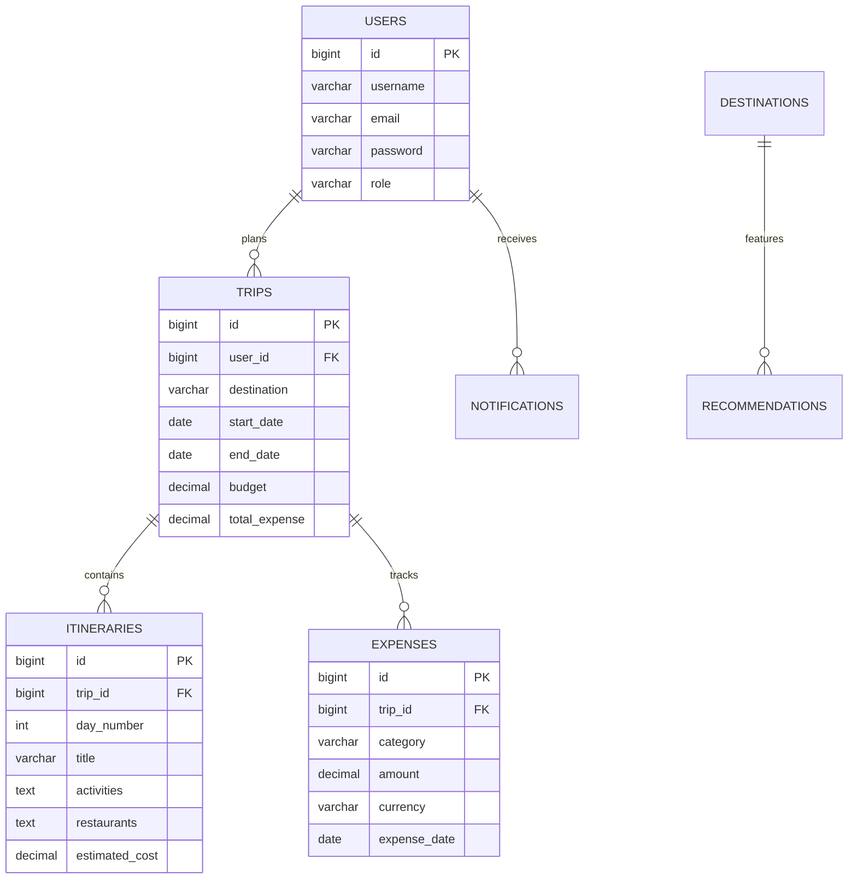

# 🗄️ JourneyMate AI - Database Schema & ER Diagram

The database follows clean relational modeling principles with foreign key constraints, index optimization, and audit timestamps (`created_at`, `updated_at`).

---

## 📊 Entity Relationship Diagram (Mermaid)

---

## 📋 Tables Description

1. **`users`**: User registration, hashed credentials, roles (`ROLE_USER`, `ROLE_ADMIN`).
2. **`trips`**: Travel metadata, budget allocations, total spending summaries.
3. **`itineraries`**: Day-wise activities, recommended dining spots, timing schedules.
4. **`expenses`**: Granular expense logging by categories (`HOTEL`, `FOOD`, `TRANSPORT`, `ACTIVITIES`, `MISCELLANEOUS`).
5. **`destinations`**: Pre-cached destination information.
6. **`weather_cache`**: Cached weather readings for API rate limit optimization.
7. **`recommendations`**: Rating and location metadata for local attractions.
8. **`notifications`**: System notifications for trip milestones.
